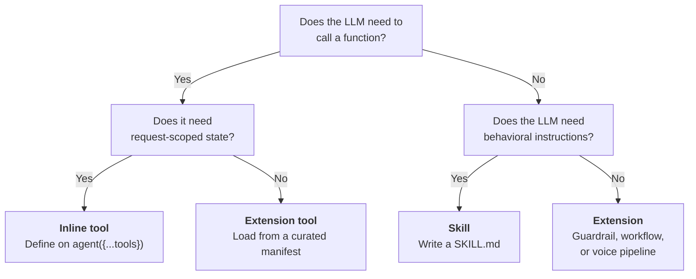
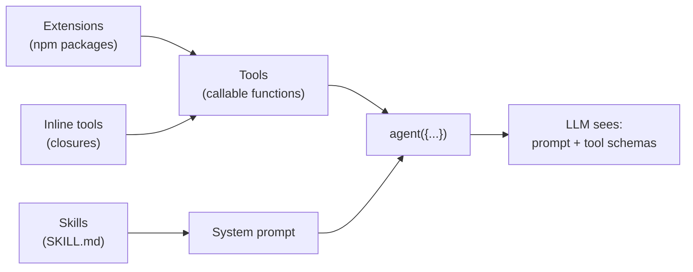

> "Make each program do one thing well. To do a new job, build afresh rather than complicate old programs by adding new features."
>
> — *The Bell System Technical Journal*, M. D. McIlroy, E. N. Pinson, and B. A. Tague, 1978

The Unix philosophy is the right starting frame for the three capability systems in AgentOS. Each one does exactly one thing. Skills tell the LLM *when* to do something. Tools are the things the LLM actually invokes. Extensions are the npm-package distribution mechanism for reusable tool sets, guardrail packs, and voice pipelines. Confusion only sets in when someone reaches for one of them to do another's job — writing a skill that tries to "execute," writing an extension tool that needs values only the app holds for each request. The page below is a map for picking the right one the first time.

## At a glance

| | Skills | Tools | Extensions |
|---|---|---|---|
| **What it is** | A `SKILL.md` file with YAML frontmatter and markdown body | A function with a JSON-schema'd parameter list, a description, and an `execute()` callback | An npm package whose pack factory returns descriptors: tools, guardrails, channels, speech providers and other kinds |
| **How it loads** | [`SkillRegistry`](https://github.com/framerslab/agentos/blob/master/src/cognition/skills/SkillRegistry.ts) reads the directories you pass to `loadFromDirs()` | Inline on `agent({...tools})`, or registered on the full runtime from an extension manifest | [`createCuratedManifest()`](https://github.com/framerslab/agentos-extensions-registry) imports the installed curated packages into a manifest; `AgentOS.create({ extensionManifest })` activates it |
| **What the LLM sees** | Text injected into the system prompt | A function-call schema (name, description, parameter shape) | Nothing directly — extensions provide tools, the LLM sees the tools |
| **When it runs** | At agent construction (prompt assembly) | During generation, when the LLM emits a tool-call | At app initialization (one-time setup) |
| **Can capture request-scoped state?** | No — prompt text only, written before the request exists | **Yes** — closures capture actorId, sessionId, policy tier, anything in scope | Not by closure. On the full runtime each call receives the request's user id and session ids in its `ToolExecutionContext`; everything else is package-scoped config |
| **Right for** | Behavioral guidelines, workflow instructions, "how to" knowledge | API calls, DB queries, vision analysis, media search, memory retrieval | Reusable bundles published once and consumed across many agents |

## The decision



Most production apps use all three. The question is never "which one" — it's "which one for *this* capability."

## Skills — prompt modules

A skill is a markdown file with YAML frontmatter. It teaches the LLM *when* and *how* to use a tool, but it cannot itself execute anything. The skill body becomes part of the system prompt; the frontmatter declares prerequisites (`requires.env`, `requires.bins`, `requires.config`) that `buildSnapshot({ strict: true })` checks before it includes the skill.

```markdown
---
name: web-search
description: Search the web for current information
metadata:
  requires:
    env: [SERPAPI_API_KEY]
---

# Web Search

When the user asks about current events, recent news, or information
that may have changed since your training cutoff, use the `web_search`
tool. Prefer specific queries over broad ones. Avoid asking the user
to confirm — search first, then respond with what you found.
```

Load skills with [`SkillRegistry`](https://github.com/framerslab/agentos/blob/master/src/cognition/skills/SkillRegistry.ts):

```typescript
import { SkillRegistry } from '@framers/agentos/cognition/skills';
import { agent } from '@framers/agentos';

const registry = new SkillRegistry();
await registry.loadFromDirs(['./skills']);

// strict: true drops skills whose requires.env / requires.bins are not met on
// this host. requires.config paths are read from runtimeConfig: a skill that
// lists one is dropped unless the path is truthy there.
const snapshot = registry.buildSnapshot({
  platform: process.platform,
  strict: true,
  runtimeConfig: { browser: { enabled: true } },
});

const myAgent = agent({
  instructions: baseInstructions + '\n\n' + snapshot.prompt,
  tools: myTools,
});
```

`loadFromDirs()` reads the files once. A `SKILL.md` changed while the process runs takes effect after `registry.clear()` and another `loadFromDirs()`, or after `registry.reload()` with the directories (`workspaceDir`, `managedSkillsDir`, `bundledSkillsDir`, `extraDirs`). `buildSnapshot()` filters by the frontmatter's `os` list when given a `platform`; with `strict: true` it also checks `requires.bins` and `requires.anyBins` against the `PATH`, `requires.env` against the environment (or the skill's `env` and `apiKey` entries in the registry's config), and `requires.config` against `runtimeConfig`, where each listed dotted path must be truthy. A skill that needs `SERPAPI_API_KEY` is left out of the snapshot when the key isn't set, and a skill that lists a `requires.config` path is left out when `runtimeConfig` is not passed. A skill whose metadata sets `always: true`, next to its `requires`, skips these checks. Without `strict`, those requirements are not checked.

## Tools — callable functions

Tools are what the LLM actually invokes. The LLM sees the tool's name, description, and parameter JSON schema; when it decides to call one, the runtime executes the `execute()` function and feeds the result back into the next generation step.

### Inline tools — the production pattern

Define tools as closures on `agent({...})` so they capture request-scoped state.

```typescript
import { agent } from '@framers/agentos';

function buildCompanionAgent(actorId: string, slug: string, policyTier: string) {
  return agent({
    name: 'Alice',
    tools: {
      analyze_image: {
        description: 'Look at an image URL to see what it contains.',
        parameters: {
          type: 'object',
          properties: {
            image_url: { type: 'string' },
          },
          required: ['image_url'],
        },
        execute: async ({ image_url }) => {
          // Closure captures actorId, slug, policyTier from the enclosing scope.
          // No global state. No registry. The tool knows who is asking.
          const description = await describeImage(image_url, { actorId, policyTier });
          await recordVisionUsage(actorId, slug, image_url);
          return { description };
        },
      },
    },
    maxSteps: 8,
  });
}
```

Memory recall for the current user, media generation under the current content policy and attachment lookup in the current conversation all close over values like these. None of those values exist at registry-load time. They only exist per-request.

On `agent()`, every tool's `execute()` receives a context whose user id is `'system'` and whose session id is made up for the call ([`generateText.ts`](https://github.com/framerslab/agentos/blob/master/src/api/generateText.ts)), so a tool there learns who is asking only from a closure. On the full runtime (`AgentOS.processRequest()`), each call's [`ToolExecutionContext`](https://github.com/framerslab/agentos/blob/master/src/core/tools/ITool.ts) carries the request's `userContext` (its `userId` included) and, in `sessionData`, the session, conversation and organization ids, so an extension tool there knows the user and the session. Values the runtime does not carry, such as an app's content-policy tier, reach a tool only through a closure.

### Extension tools

For tools that don't need request-scoped state — `web-search`, `giphy`, generic API wrappers — extension packages are cleaner. They live in their own npm packages, declare the secrets they need, and are switched off per manifest with `overrides: { 'giphy': { enabled: false } }`:

```typescript
import { AgentOS } from '@framers/agentos';
import { createCuratedManifest } from '@framers/agentos-extensions-registry';

const extensionManifest = await createCuratedManifest({
  tools: ['web-search', 'giphy', 'image-search'],
  // Every category left out defaults to 'all' installed packs.
  channels: 'none',
  voice: 'none',
  productivity: 'none',
  cloud: 'none',
  domains: 'none',
});

const agentos = await AgentOS.create({ extensionManifest });
```

`createCuratedManifest()` imports each named pack that is installed and warns about a named pack it cannot load; each category it is not given (`channels`, `voice`, `productivity`, `cloud`, `domains`) defaults to every installed pack of that category. The runtime calls the packs' factories when it initializes, and skips with a warning any descriptor whose required secrets are missing. `agent()` takes no manifest.

## Extensions — reusable packages

Extensions are the distribution mechanism. The curated ones are npm packages under [`registry/curated/`](https://github.com/framerslab/agentos-extensions/tree/master/registry/curated) in agentos-extensions. A pack's factory returns descriptors, and each descriptor's `kind` says what it provides. Common kinds:

| Kind | What it provides |
|---|---|
| `tool` | Callable function for the LLM (web-search, weather, email, etc.) |
| `guardrail` | Input or output safety check (`pii-redaction`, `grounding-guard`, `topicality`, etc.) |
| `workflow` | Reusable workflow definition for the orchestration engine |
| `messaging-channel` | A chat platform adapter (Discord, Slack, Telegram and others) |
| `stt-provider`, `tts-provider` | Speech-to-text and text-to-speech providers |
| `memory-provider` | A memory backend |
| `provenance` | Content-anchoring provider (blockchain attestation, signature verification) |

`ExtensionKind` is a string; [`src/extensions/types.ts`](https://github.com/framerslab/agentos/blob/master/src/extensions/types.ts) declares the built-in kinds, among them `response-processor`, `persona`, `planning-strategy`, `hitl-handler`, `http-handler` and the streaming voice kinds.

The same `createCuratedManifest()` resolves any combination. Guardrail packs are catalog entries named in `tools`; there is no `guardrails` option:

```typescript
const manifest = await createCuratedManifest({
  tools: ['web-search', 'web-browser', 'pii-redaction', 'grounding-guard'],
  voice: ['speech-runtime'],
  channels: 'none',
  productivity: 'none',
  cloud: 'none',
  domains: 'none',
});
```

Missing secrets skip descriptors rather than fail the runtime: when it activates the manifest, `ExtensionManager` skips a descriptor whose required secrets resolve neither from the configured secrets nor from their environment variables, with one warning each. A manifest that asks for ten tools with keys for seven yields seven loaded tools and three warnings. This is intentional — production manifests are stable across environments where some integrations are deployment-specific.

## How they compose

All three layers cooperate per agent. Loading order:

1. **Extensions** resolve at app initialization: `createCuratedManifest()` imports the packages, and the runtime calls their factories and registers the descriptors when it initializes
2. **Inline tools** are defined on `agent({...})` per request; tools from a manifest are registered on the full runtime
3. **Skills** are injected into the system prompt at agent construction, teaching the LLM *when* to reach for which tool



The LLM ends up with one system prompt (assembled from skills + persona + memory + RAG context) and one set of tool schemas (inline + extension). It generates text and tool calls. The runtime executes the tool calls and feeds results back into the loop.

## Common mistakes

**Writing a skill when you need a tool.** A skill can tell the LLM "use web search when the user asks about current events." It cannot perform the search. If you need side effects, you need a tool.

**Writing an extension when you need an inline tool.** Extensions provide tools from packages with package-scoped config. If your tool needs to know the current user's ID, the conversation slug, or the policy tier — anything that only exists per-request — it cannot come from an extension. Define it inline on `agent({...})`.

**Skipping skills for complex tools.** A tool's name + description + parameter schema is enough for self-explanatory tools (`web_search`, `get_weather`). Less obvious ones (`analyze_image`, `recall_memories`, `forge_tool`) benefit from a SKILL.md that teaches the LLM when each is appropriate. Without the skill, you get the LLM calling `analyze_image` on text content, or skipping it when the user clearly references an image.

**Treating the registry as the source of truth.** Skills load when you call `loadFromDirs()`; the registry is a convenience for organizing them, not a runtime authority. The system prompt the LLM actually sees is whatever you assembled at `agent({...})` construction. If you forgot to inject `snapshot.prompt`, the skill is functionally invisible no matter what the registry says.

## Source

- Skills: [`src/cognition/skills/`](https://github.com/framerslab/agentos/tree/master/src/cognition/skills) in agentos
- Tools: [`src/core/tools/`](https://github.com/framerslab/agentos/tree/master/src/core/tools) in agentos
- Extension runtime: [`src/extensions/`](https://github.com/framerslab/agentos/tree/master/src/extensions) in agentos
- Curated extensions: [`registry/curated/`](https://github.com/framerslab/agentos-extensions/tree/master/registry/curated) in agentos-extensions
- Curated manifest builder: [`agentos-extensions-registry`](https://github.com/framerslab/agentos-extensions-registry)
