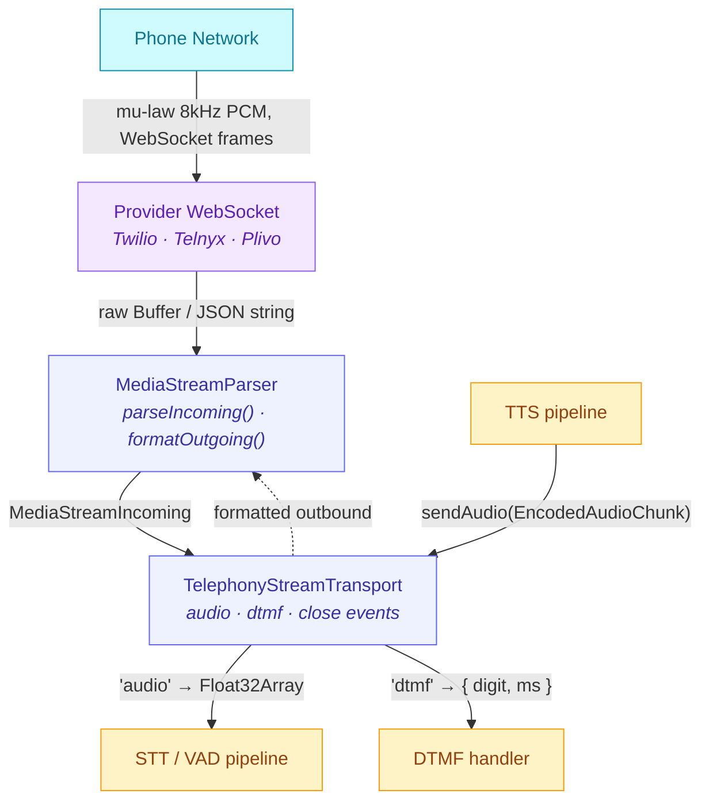

A real phone call has stricter latency budgets than any chat surface. Twilio's docs say "audio gaps over 200ms feel unnatural"; in practice anything over 400ms gets users hanging up. The voice path through AgentOS is built around that constraint: the [voice pipeline](/features/voice-pipeline) runs end-to-end at low enough latency to feel like a conversation, and the telephony layer extends that into the PSTN by speaking the same streaming protocol — incoming caller audio is decoded to Float32 frames for VAD/STT, outbound TTS audio is re-encoded to mu-law on the way back to the phone, all through a full-duplex WebSocket. The provider is interchangeable.

Three providers ship in-tree at [`src/channels/telephony/providers/`](https://github.com/framerslab/agentos/tree/master/src/channels/telephony/providers): **Twilio**, **Telnyx**, and **Plivo**. All three implement [`IVoiceCallProvider`](https://github.com/framerslab/agentos/blob/master/src/channels/telephony/IVoiceCallProvider.ts) and are wired through the central [`CallManager`](https://github.com/framerslab/agentos/blob/master/src/channels/telephony/CallManager.ts) state machine. There's also a mock provider for testing.

---

## Table of Contents

1. [Overview](#overview)
2. [Provider Setup](#provider-setup)
   - [Twilio](#twilio)
   - [Telnyx](#telnyx)
   - [Plivo](#plivo)
3. [Call Modes](#call-modes)
4. [Webhook Configuration](#webhook-configuration)
5. [DTMF Handling](#dtmf-handling)
6. [Media Stream Flow](#media-stream-flow)
7. [agent.config.json — telephony section](#agentconfigjson--telephony-section)
8. [CLI Flags](#cli-flags)

---

## Overview

The telephony system is made up of three cooperating layers:

| Layer | Purpose |
|---|---|
| [`IVoiceCallProvider`](https://github.com/framerslab/agentos/blob/master/src/io/channels/telephony/IVoiceCallProvider.ts) | Initiates/hangs up calls, verifies webhooks, parses events |
| [`CallManager`](https://github.com/framerslab/agentos/blob/master/src/io/channels/telephony/CallManager.ts) | State machine — enforces monotonic call state transitions |
| [`TelephonyStreamTransport`](https://github.com/framerslab/agentos/blob/master/src/io/channels/telephony/TelephonyStreamTransport.ts) | Bridges a provider WebSocket media stream to the voice pipeline |
| [`MediaStreamParser`](https://github.com/framerslab/agentos/blob/master/src/io/channels/telephony/MediaStreamParser.ts) (per provider) | Normalises provider-specific WebSocket frames |

Agents communicate with callers over a full-duplex WebSocket media stream (mu-law
8 kHz PCM). The transport decodes incoming audio to Float32 frames for VAD/STT and
re-encodes outbound TTS audio back to mu-law for delivery to the caller.

---

## Provider Setup

### Twilio

**Account requirements**

1. Create a Twilio account at <https://twilio.com> and note your **Account SID**
   and **Auth Token** from the Console dashboard.
2. Purchase or port a phone number with *Voice* capability.
3. Enable **Programmable Voice** → **TwiML Apps** if you want a central TwiML
   application (optional; webhook URLs can be set per number).

**Required environment variables**

```sh
TWILIO_ACCOUNT_SID=ACxxxxxxxxxxxxxxxxxxxxxxxxxxxxxxxx
TWILIO_AUTH_TOKEN=your_auth_token
TWILIO_FROM_NUMBER=+15551234567   # E.164 format
```

**Programmatic usage**

```typescript
import { TwilioVoiceProvider } from '@framers/agentos/voice';

const provider = new TwilioVoiceProvider({
  accountSid: process.env.TWILIO_ACCOUNT_SID!,
  authToken:  process.env.TWILIO_AUTH_TOKEN!,
});
```

---

### Telnyx

**Account requirements**

1. Create a Telnyx account at <https://telnyx.com>.
2. Generate an **API key** (Mission Control Portal → Auth → API Keys).
3. Purchase a phone number and assign it to a **TeXML Application** or
   **Messaging Profile** (for voice, use a TeXML Application and set the
   webhook URL — see [Webhook Configuration](#webhook-configuration)).

**Required environment variables**

```sh
TELNYX_API_KEY=KEY0123456789ABCDEF...
TELNYX_FROM_NUMBER=+15559876543
```

**Programmatic usage**

```typescript
import { TelnyxVoiceProvider } from '@framers/agentos/voice';

const provider = new TelnyxVoiceProvider({
  apiKey:      process.env.TELNYX_API_KEY!,
  fromNumber:  process.env.TELNYX_FROM_NUMBER,
});
```

---

### Plivo

**Account requirements**

1. Create a Plivo account at <https://plivo.com>.
2. Note your **Auth ID** and **Auth Token** from the Console overview.
3. Purchase or rent a phone number with *Voice* capability.

**Required environment variables**

```sh
PLIVO_AUTH_ID=MAxxxxxxxxxxxxxxxxxxxxxxxxxxxxxxxx
PLIVO_AUTH_TOKEN=your_plivo_auth_token
PLIVO_FROM_NUMBER=+15557654321
```

**Programmatic usage**

```typescript
import { PlivoVoiceProvider } from '@framers/agentos/voice';

const provider = new PlivoVoiceProvider({
  authId:     process.env.PLIVO_AUTH_ID!,
  authToken:  process.env.PLIVO_AUTH_TOKEN!,
  fromNumber: process.env.PLIVO_FROM_NUMBER,
});
```

---

## Call Modes

Each call is initiated in one of two modes:

| Mode | Description |
|---|---|
| `conversation` | Full-duplex: inbound STT → LLM → outbound TTS. Requires a media stream WebSocket. |
| `notify` | One-way TTS: speak a message and hang up. No media stream needed. |

Set the default mode in `agent.config.json` (see below) or per-call:

```typescript
await manager.initiateCall({
  toNumber: '+15550001234',
  mode: 'notify',
  message: 'Your order has shipped.',
});
```

For `conversation` mode the provider generates a TwiML/TeXML/XML response that
opens a bidirectional media stream back to your server. The URL is constructed
automatically from `streaming.wsPath` in the agent config.

---

## Webhook Configuration

Each provider sends HTTP POST callbacks to your server for call status changes
(ringing, answered, completed, etc.). You must expose a public HTTPS URL.

### URL structure (default)

```
POST https://<your-domain>/api/voice/webhook/twilio
POST https://<your-domain>/api/voice/webhook/telnyx
POST https://<your-domain>/api/voice/webhook/plivo
```

For local development, start the listener via the [Wunderland](https://wunderland.sh)
CLI's `chat --telephony-webhook-port=...` flags ([documented below](#cli-flags))
and expose it with a tunnel (`ngrok http 3001`).

Programmatically, wire the webhook routes onto your own HTTP server using the
exports from `@framers/agentos/channels/telephony` — [`CallManager`](https://github.com/framerslab/agentos/blob/master/src/io/channels/telephony/CallManager.ts),
[`TelephonyStreamTransport`](https://github.com/framerslab/agentos/blob/master/src/io/channels/telephony/TelephonyStreamTransport.ts), and the per-provider media-stream parsers
([`TwilioMediaStreamParser`](https://github.com/framerslab/agentos/blob/master/src/io/channels/telephony/parsers/TwilioMediaStreamParser.ts), [`TelnyxMediaStreamParser`](https://github.com/framerslab/agentos/blob/master/src/io/channels/telephony/parsers/TelnyxMediaStreamParser.ts), [`PlivoMediaStreamParser`](https://github.com/framerslab/agentos/blob/master/src/io/channels/telephony/parsers/PlivoMediaStreamParser.ts))
— mounted under whatever framework you already run. A drop-in
`startTelephonyWebhookServer` factory is on the roadmap but has not shipped
yet; until then, the CLI is the no-code path and the manager + transport are
the manual path.

### Signature verification

All three providers sign their webhook payloads:

| Provider | Algorithm | Header |
|---|---|---|
| Twilio | HMAC-SHA1 over sorted form params | `x-twilio-signature` |
| Telnyx | HMAC-SHA256 over raw body | `telnyx-signature-ed25519` |
| Plivo | HMAC-SHA256 over sorted form params | `x-plivo-signature-v2` |

Signature verification is performed automatically by each provider's
`verifyWebhook()` method before any events are dispatched.

### Provider console settings

**Twilio** — phone number → Voice Configuration → set both:
- "A call comes in" → Webhook → `https://your-domain/api/voice/webhook/twilio`
- "Call Status Changes" → `https://your-domain/api/voice/status/twilio`

**Telnyx** — TeXML Application → Inbound Settings:
- "Send a webhook to the URL" → `https://your-domain/api/voice/webhook/telnyx`

**Plivo** — phone number → Application → set:
- "Answer URL" → `https://your-domain/api/voice/webhook/plivo`
- "Hangup URL" → `https://your-domain/api/voice/status/plivo`

---

## DTMF Handling

All providers deliver DTMF (touch-tone) digits either in-band (as part of the
media stream) or as separate webhook events. AgentOS normalises both paths into
the same [`NormalizedDtmfReceived`](https://github.com/framerslab/agentos/blob/master/src/io/channels/telephony/types.ts) event:

```typescript
manager.on((event) => {
  if (event.type === 'call:dtmf') {
    const { digit, durationMs } = event.data as { digit: string; durationMs?: number };
    console.log(`Caller pressed: ${digit} (held ${durationMs ?? '?'}ms)`);
  }
});
```

The [`TelephonyStreamTransport`](https://github.com/framersai/agentos/blob/master/src/io/channels/telephony/TelephonyStreamTransport.ts) re-emits DTMF events directly from the media
stream (before they reach the [`CallManager`](https://github.com/framersai/agentos/blob/master/src/io/channels/telephony/CallManager.ts)):

```typescript
transport.on('dtmf', ({ digit, durationMs }) => {
  // Handle real-time key press during media stream
});
```

Common DTMF use cases:

- IVR menu navigation (`1` = sales, `2` = support, …)
- PIN / passcode entry
- Opt-out flows (`9` to stop notifications)

---

## Media Stream Flow

The following diagram shows the path of inbound audio (phone → pipeline) and
outbound TTS audio (pipeline → phone) for a `conversation` mode call.



**Inbound path (phone → pipeline)**

1. Provider delivers a WebSocket frame (JSON string or binary Buffer).
2. `MediaStreamParser.parseIncoming()` normalises it to a [`MediaStreamIncoming`](https://github.com/framerslab/agentos/blob/master/src/io/channels/telephony/MediaStreamParser.ts)
   discriminated union (`start | audio | dtmf | stop | mark`).
3. `audio` events: mu-law 8 kHz → Int16 PCM → upsample to pipeline rate → Float32.
4. The [`AudioFrame`](https://github.com/framerslab/agentos/blob/master/src/io/voice-pipeline/types.ts) is emitted from the transport for VAD / STT consumption.

**Outbound path (pipeline → phone)**

1. TTS pipeline produces an [`EncodedAudioChunk`](https://github.com/framerslab/agentos/blob/master/src/io/voice-pipeline/types.ts) (PCM Int16 at pipeline sample rate).
2. `TelephonyStreamTransport.sendAudio()` resamples it to 8 kHz.
3. PCM is mu-law encoded.
4. `MediaStreamParser.formatOutgoing()` wraps it in the provider envelope (e.g., Twilio JSON).
5. The formatted payload is sent over the WebSocket.

---

## agent.config.json — telephony section

Add a `telephony` block to your agent's `agent.config.json`:

```json
{
  "telephony": {
    "provider": "twilio",
    "webhookBaseUrl": "https://your-domain.com",
    "defaultMode": "conversation",
    "inboundPolicy": "allowlist",
    "allowedNumbers": ["+15550001111", "+15550002222"],
    "streaming": {
      "enabled": true,
      "wsPath": "/voice/media-stream"
    },
    "tts": {
      "provider": "openai",
      "voice": "alloy",
      "speed": 1.0
    }
  }
}
```

| Field | Type | Description |
|---|---|---|
| `provider` | `"twilio" \| "telnyx" \| "plivo"` | Active telephony provider |
| `webhookBaseUrl` | `string` | Public HTTPS base URL for webhook callbacks |
| `defaultMode` | `"conversation" \| "notify"` | Default call interaction mode |
| `inboundPolicy` | `"disabled" \| "allowlist" \| "pairing" \| "open"` | How to handle inbound calls |
| `allowedNumbers` | `string[]` | E.164 numbers allowed when `inboundPolicy = "allowlist"` |
| `streaming.enabled` | `boolean` | Enable WebSocket media streaming |
| `streaming.wsPath` | `string` | WebSocket path appended to `webhookBaseUrl` |
| `tts.provider` | `string` | TTS provider for voice synthesis (openai, elevenlabs) |
| `tts.voice` | `string` | Voice ID / name |
| `tts.speed` | `number` | Speech rate multiplier (1.0 = normal) |

---

## CLI Flags

### Voice pipeline flags (existing)

These flags enable the local WebSocket voice pipeline server during a
chat session:

| Flag | Type | Description |
|---|---|---|
| `--voice` | boolean | Enable the local voice pipeline WebSocket server |
| `--voice-stt=<id>` | string | STT provider override (e.g. `deepgram`, `whisper-chunked`) |
| `--voice-tts=<id>` | string | TTS provider override (e.g. `openai`, `elevenlabs`) |
| `--voice-endpointing=<strategy>` | string | Endpointing: `acoustic`, `heuristic`, `semantic` |
| `--voice-diarization` | boolean | Enable speaker diarization |
| `--voice-barge-in=<mode>` | string | Barge-in: `hard-cut`, `soft-fade`, `disabled` |
| `--voice-port=<n>` | number | WebSocket server port (`0` = OS-assigned) |

### Telephony webhook server flags

These flags configure the telephony HTTP webhook listener:

| Flag | Type | Default | Description |
|---|---|---|---|
| `--telephony-provider=<name>` | string | — | Provider: `twilio`, `telnyx`, or `plivo` |
| `--telephony-webhook-port=<n>` | number | `0` | HTTP port for the webhook server |
| `--telephony-webhook-host=<addr>` | string | `127.0.0.1` | Bind address for the webhook server |
| `--telephony-webhook-path=<path>` | string | `/api/voice` | URL base path for webhook routes |

**Example**

These flags are implemented on the [`wunderland`](https://wunderland.sh)
CLI (`npm install -g @framers/wunderland`):

```sh
# Start a chat session with the Twilio webhook server on port 3001
wunderland chat \
  --telephony-provider=twilio \
  --telephony-webhook-port=3001 \
  --telephony-webhook-host=0.0.0.0 \
  --telephony-webhook-path=/api/voice
```

> For local development, expose the server with a tunnel tool (e.g. `ngrok http 3001`)
> and set the resulting HTTPS URL as the webhook in your provider console.
