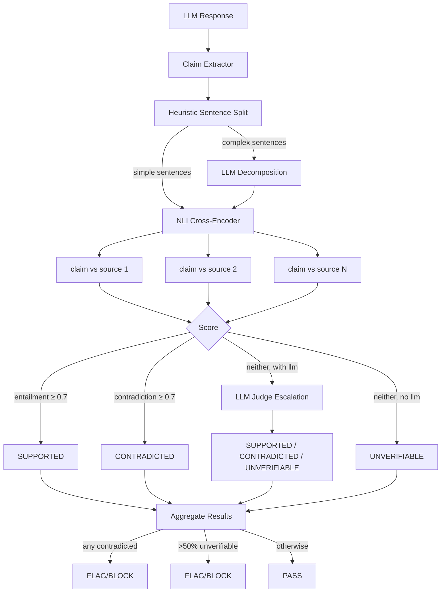

# Grounding Guard

RAG-grounded hallucination detection using a hybrid NLI cross-encoder and LLM-as-judge pipeline. Verifies that claims in LLM output are faithful to retrieved source documents.

**Package:** `@framers/agentos-ext-grounding-guard`

---

## Overview



The Grounding Guard extension provides two modes of operation:

- **Passive protection** via a built-in guardrail that automatically verifies response faithfulness against RAG source documents during streaming and on final response
- **Active capability** via an agent-callable tool (`check_grounding`) for on-demand grounding verification

It checks each claim in the agent's response against the retrieved source chunks:

- **Supported** -- claim is entailed by at least one source document
- **Contradicted** -- claim directly contradicts a source document
- **Unverifiable** -- claim cannot be found in any source (potential hallucination)

The verification pipeline uses two tiers:

1. **Tier 1: NLI Cross-Encoder** (`Xenova/nli-deberta-v3-small` through transformers.js; the default 8-bit weight file is 172 MB): entailment and contradiction scores for each claim-source pair
2. **Tier 2: LLM-as-Judge**: chain-of-thought verification for claims the NLI model leaves ambiguous, only when an `llm` function is configured

Only runs when RAG sources are present. No sources means no verification (no-op).

---

## Prerequisites

The grounding guard requires RAG source plumbing -- specifically, `ragSources` must be present on the [`GuardrailOutputPayload`](https://github.com/framerslab/agentos/blob/master/src/safety/guardrails/IGuardrailService.ts). This is populated automatically by AgentOS when RAG retrieval is performed for a request.

The `ragSources` field contains `RagRetrievedChunk[]` from the [`RetrievalAugmentor`](https://github.com/framerslab/agentos/blob/master/src/cognition/rag/RetrievalAugmentor.ts), threaded from the GMI through the response stream to the guardrail layer. When no RAG retrieval was performed, the field is undefined and the guardrail is a no-op.

---

## Installation

```bash
npm install @framers/agentos-ext-grounding-guard
```

The NLI model requires `@huggingface/transformers` (an optional dependency of AgentOS):

```bash
npm install @huggingface/transformers
```

---

## Usage

### Direct factory usage

```typescript
import { AgentOS, generateText } from '@framers/agentos';
import { createGroundingGuardrail } from '@framers/agentos-ext-grounding-guard';

const groundingPack = createGroundingGuardrail({
  entailmentThreshold: 0.7,
  contradictionThreshold: 0.7,
  maxUnverifiableRatio: 0.5,
  contradictionAction: 'flag',
  // Any (prompt) => Promise<string> function; used for claim decomposition and escalation.
  llm: async (prompt) =>
    (await generateText({ provider: 'anthropic', model: 'claude-haiku-4-5-20251001', prompt })).text,
});

const agentos = await AgentOS.create({
  extensionManifest: { packs: [{ factory: () => groundingPack }] },
});
```

### Manifest-based loading

```typescript
const agentos = await AgentOS.create({
  extensionManifest: {
    packs: [
      {
        package: '@framers/agentos-ext-grounding-guard',
        options: {
          contradictionAction: 'block',
          maxUnverifiableRatio: 0.3,
        },
      },
    ],
  },
});
```

---

## ClaimExtractor

Decomposes response text into atomic factual claims for grounding verification using a two-tier extraction approach.

### Tier 1: Heuristic Sentence Splitting

For simple sentences (20 words or fewer, with none of the conjunction signals below):

1. Split on sentence boundaries (`. `, `? `, `! `, `\n`)
2. Filter non-factual content (questions, hedges, meta-commentary, greetings, code blocks)
3. Simple sentences pass through as-is

**Heuristic filters** (sentences that are NOT factual claims):

- Questions: ends with `?`
- Hedges: starts with "I think", "maybe", "perhaps", "it seems", "I believe"
- Meta: "I hope this helps", "let me know if", "feel free to", "here's"
- Greetings: "hello", "hi there", "sure!", "great question", "of course"
- Code blocks: anything inside triple-backtick fences

### Tier 2: LLM Decomposition

For complex sentences (>20 words or multiple clauses):

Detected by: word count > 20, or one of the conjunction signals `, and `, `; `, ` while `, ` however `, ` additionally `.

Sent to a lightweight LLM with a structured decomposition prompt that returns an array of atomic factual claims.

When no LLM is configured, all sentences use heuristic mode (no decomposition).

---

## GroundingChecker

Verifies claims against source documents using the two-tier pipeline.

### Tier 1: NLI Cross-Encoder

- **Model:** `Xenova/nli-deberta-v3-small` (`nliModelId`), loaded through transformers.js with the `dtype` weight file (`'q8'` by default)
- **Input:** the source chunk as the premise and the claim as the hypothesis
- **Output:** entailment / contradiction / neutral scores

For each claim, the top N source chunks (default 5, sorted by relevance score) are scored one after another. A best entailment at or above `entailmentThreshold` makes the claim supported, checked first; otherwise a best contradiction at or above `contradictionThreshold` makes it contradicted. The chunk behind the deciding score is returned as the attribution:

```
Claim: "The API rate limit is 1000 req/min"

Source 1 (relevance 0.91): "Premium users get 1000 requests per minute"
  -> NLI: entailment 0.92 -> SUPPORTED

Source 2 (relevance 0.85): "Free tier is limited to 500 req/min"
  -> NLI: contradiction 0.78 -> (not best match, source 1 wins)

Best match: Source 1, verdict: SUPPORTED, confidence: 0.92
```

### Tier 2: LLM-as-Judge Escalation

When the NLI scores are ambiguous (neither reaches its threshold) and an `llm` function is configured, the claim is escalated: the prompt gives the LLM the claim and the top sources, asks it to think step by step, and asks for a JSON object `{ verdict, confidence, reasoning }` with a verdict of supported, contradicted or unverifiable. A failed call or a reply without a valid object leaves the claim `unverifiable`.

If no source reaches either threshold and no LLM is configured, the verdict is `unverifiable`.

---

## Streaming and Final Evaluation

### Streaming Phase (TEXT_DELTA)

During streaming, the guardrail buffers text at sentence boundaries:

1. Append TEXT_DELTA to sentence buffer
2. On sentence boundary: extract sentence, filter non-factual content
3. For factual claims (when `enableStreamingChecks` is on): check the sentence against the top `maxSourcesPerClaim` `ragSources`, escalating to the LLM when one is configured and the NLI scores are ambiguous
4. Contradicted: FLAG, or BLOCK with `contradictionAction: 'block'`, at once
5. Otherwise: pass; the final phase checks every claim again

### Final Phase (isFinal / FINAL_RESPONSE)

On stream completion, a comprehensive check runs:

1. Extract ALL claims from the full response text (heuristic + LLM decomposition for complex sentences)
2. For each claim: NLI against ragSources (top-5 per claim)
3. Ambiguous claims: escalate to LLM-as-judge
4. Aggregate results:
   - Any contradicted claim: FLAG or BLOCK (per `contradictionAction`)
   - Unverifiable ratio > `maxUnverifiableRatio`: FLAG (per `unverifiableAction`)
   - All supported: pass

---

## Verdicts

| Verdict        | Meaning                                  | Trigger                                                                     |
| -------------- | ---------------------------------------- | --------------------------------------------------------------------------- |
| `supported`    | Claim is entailed by at least one source | NLI entailment ≥ threshold, or the LLM judge says supported                 |
| `contradicted` | Claim directly contradicts a source      | NLI contradiction ≥ threshold (and entailment below it), or LLM confirms    |
| `unverifiable` | Claim not found in any source            | Neither score reaches its threshold and no LLM, the LLM says unverifiable, or the NLI model could not score any pair |

---

## Configuration

### `GroundingGuardOptions`

| Option                   | Type                                     | Default                                | Description                                                                                                               |
| ------------------------ | ---------------------------------------- | -------------------------------------- | ------------------------------------------------------------------------------------------------------------------------- |
| `nliModelId`             | `string`                                 | `'Xenova/nli-deberta-v3-small'`        | NLI cross-encoder model ID (an ONNX export transformers.js can load).                                                     |
| `entailmentThreshold`    | `number`                                 | `0.7`                                  | NLI score threshold for entailment (SUPPORTED).                                                                           |
| `contradictionThreshold` | `number`                                 | `0.7`                                  | NLI score threshold for contradiction (CONTRADICTED).                                                                     |
| `maxUnverifiableRatio`   | `number`                                 | `0.5`                                  | Maximum fraction of unverifiable claims before flagging.                                                                  |
| `contradictionAction`    | `'flag' \| 'block'`                      | `'flag'`                               | Action when a contradiction is detected.                                                                                  |
| `unverifiableAction`     | `'flag' \| 'block'`                      | `'flag'`                               | Action when unverifiable ratio is exceeded.                                                                               |
| `llm`                    | `(prompt: string) => Promise<string>`    | —                                      | LLM function for claim decomposition and ambiguous escalation. When omitted, heuristic-only claims + NLI-only verification. |
| `maxSourcesPerClaim`     | `number`                                 | `5`                                    | Max source chunks to compare each claim against.                                                                          |
| `enableStreamingChecks`  | `boolean`                                | `true`                                 | Enable streaming sentence-level NLI checks. When false, only the final comprehensive check runs.                          |
| `dtype`                  | `'q8' \| 'fp32' \| ...`                  | `'q8'`                                 | Which weight file to load: `'q8'` (172 MB for the default model) or `'fp32'` (568 MB).                                     |
| `quantized`              | `boolean`                                | —                                      | Deprecated: `quantized: false` is `dtype: 'fp32'`.                                                                        |
| `guardrailScope`         | `'input' \| 'output' \| 'both'`          | `'output'`                             | The guardrail never evaluates input: `'input'` turns it off, and `'both'` acts as `'output'`.                             |

---

## Agent Tools

### `check_grounding`

On-demand grounding verification. Lets agents proactively verify claims against source text before including them in responses.

```
Agent: Let me verify this synthesized answer is grounded in the sources.
-> check_grounding({
    text: "The API rate limit is 1000 req/min",
    sources: ["Premium users get 1000 requests per minute."]
  })
<- output: {
    grounded: true,
    claims: [{
      claim: "The API rate limit is 1000 req/min",
      verdict: "supported",
      confidence: 0.92,
      bestSource: { chunkId: "synthetic-source-0", content: "Premium users...", score: 0.92 },
      escalated: false
    }],
    totalClaims: 1,
    supportedCount: 1,
    contradictedCount: 0,
    unverifiableCount: 0,
    unverifiableRatio: 0,
    summary: "1/1 claims supported, 0 contradicted, 0 unverifiable (ratio 0.00)"
  }
```

`grounded` is true when no claim is contradicted and at most half are unverifiable (a fixed 0.5 for the tool). The tool accepts `sources: string[]` (plain text) for simplicity. These are wrapped as synthetic [`RagRetrievedChunk`](https://github.com/framerslab/agentos/blob/master/src/cognition/rag/IRetrievalAugmentor.ts) objects internally.

---

## Reason Codes

| Reason Code               | Trigger                                             | Metadata                                    |
| ------------------------- | --------------------------------------------------- | ------------------------------------------- |
| `GROUNDING_CONTRADICTION` | Claim contradicts a source                          | Per-claim verification results, best source |
| `GROUNDING_UNVERIFIABLE`  | Too many claims not found in sources                | Unverifiable ratio, claim details           |

A response with no RAG sources gets no result at all.

---

## Memory Impact

| Component                  | Size                                                | When Loaded                  |
| -------------------------- | --------------------------------------------------- | ---------------------------- |
| NLI model weights          | 172 MB file for the default `q8`, 568 MB for `fp32` | First claim-source pair      |
| Per-stream sentence buffer | The text of the current unfinished sentence         | First TEXT_DELTA             |

The NLI function is made once and shared through the [`ISharedServiceRegistry`](https://github.com/framerslab/agentos/blob/master/src/extensions/ISharedServiceRegistry.ts) under `agentos:grounding:nli-pipeline`; packs that ask for that id get the same loaded model.

---

## Graceful Degradation

| Condition                            | Behavior                                                                     |
| ------------------------------------ | ---------------------------------------------------------------------------- |
| No `ragSources` on payload           | No-op -- returns null (cannot ground without sources)                        |
| NLI model fails to load              | Every claim is `unverifiable` and is not escalated, even with an LLM; the final check then reports `GROUNDING_UNVERIFIABLE` (FLAG, or BLOCK per `unverifiableAction`) when the ratio exceeds `maxUnverifiableRatio` |
| LLM not configured                   | NLI-only mode -- heuristic claims, no decomposition, no ambiguous escalation |
| Empty response (no claims extracted) | Returns null                                                                 |
| `ragSources` present but empty array | Returns null (no sources to compare against)                                 |

---

## Related Documentation

- [Guardrails](/features/guardrails)
- [Extension Architecture](/extensions/extension-architecture)
- [Extensions Overview](/extensions)
- [RAG Memory](/features/rag-memory)
- [PII Redaction](/extensions/built-in/pii-redaction)
- [ML Content Classifiers](/extensions/built-in/ml-classifiers)
- [Topicality](/extensions/built-in/topicality)
- [Code Safety](/extensions/built-in/code-safety)
