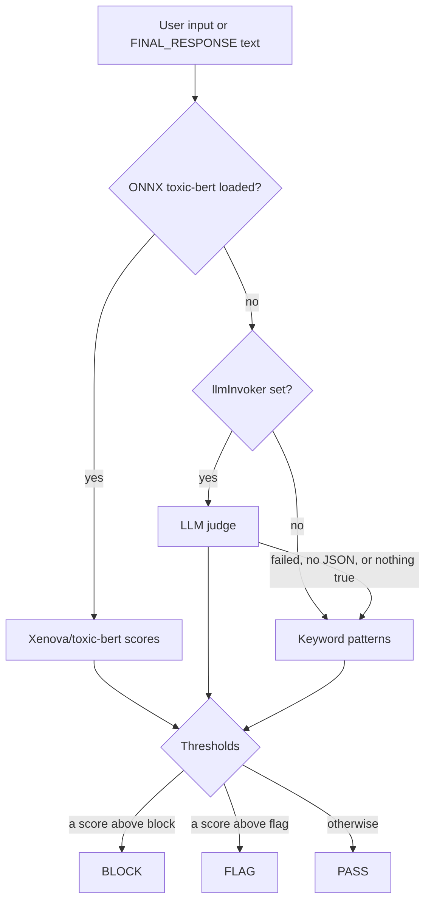

# ML Content Classifiers

Content safety classification of user input and final responses across four categories: `toxic`, `injection`, `nsfw` and `threat`. Each text goes to the first tier that answers: an ONNX toxicity model, an LLM judge, or keyword patterns.

**Package:** `@framers/agentos-ext-ml-classifiers` (this page describes 0.3.1)

---

## Overview



The ML Content Classifiers extension provides two modes of operation:

- **Passive protection** via a guardrail that classifies the user's text input and the text of the final response (`FINAL_RESPONSE`). It does not evaluate streamed chunks (`evaluateStreamingChunks: false`).
- **Active capability** via an agent-callable tool (`classify_content`) for on-demand classification.

### Tiers

1. **ONNX**: the `@huggingface/transformers` text-classification pipeline with `Xenova/toxic-bert` on the CPU, loaded on the first classification. Its labels map to categories: `toxic`, `severe_toxic`, `insult` and `identity_hate` to `toxic`, `obscene` to `nsfw`, and `threat` to `threat`. The model has no injection label, so `injection` scores 0 whenever this tier answers, and while the model is loaded the other tiers do not run.
2. **LLM judge**: when the model cannot load and `llmInvoker` is set. A system prompt asks for a JSON object with a boolean per category and one `confidence`; each category marked true gets that confidence (0.7 when the reply gives none). A failed call, a reply without parseable JSON, or a reply with no category true falls through to the keyword tier.
3. **Keywords**: regex patterns per category (for example "ignore previous instructions" or "you are now DAN" for `injection`). One matching pattern scores 0.4, and each further matching pattern of the same category adds 0.15, up to 1.0.

A model that fails to load is not tried again for the life of the guardrail.

---

## Installation

```bash
npm install @framers/agentos-ext-ml-classifiers
```

The ONNX tier needs `@huggingface/transformers` (an optional dependency of AgentOS). Without it, the LLM judge or the keyword patterns classify:

```bash
npm install @huggingface/transformers
```

---

## Usage

### Direct factory usage

```typescript
import { AgentOS, generateText } from '@framers/agentos';
import { createMLClassifierGuardrail } from '@framers/agentos-ext-ml-classifiers';

const mlPack = createMLClassifierGuardrail({
  categories: ['toxic', 'injection', 'threat'],
  flagThreshold: 0.5,
  blockThreshold: 0.8,
  thresholds: { injection: { block: 0.6 } },
  // Used only when the ONNX model cannot load.
  llmInvoker: async (system, user) =>
    (await generateText({ provider: 'openai', model: 'gpt-4o-mini', system, prompt: user })).text,
});

const agentos = await AgentOS.create({
  extensionManifest: { packs: [{ factory: () => mlPack }] },
});
```

### Manifest-based loading

```typescript
const agentos = await AgentOS.create({
  extensionManifest: {
    packs: [
      {
        package: '@framers/agentos-ext-ml-classifiers',
        options: {
          categories: ['toxic', 'injection'],
          blockThreshold: 0.9,
        },
      },
    ],
  },
});
```

### Via curated registry

```typescript
import { AgentOS } from '@framers/agentos';
import { createCuratedManifest } from '@framers/agentos-extensions-registry';

const manifest = await createCuratedManifest({
  tools: ['ml-classifiers'],
  channels: 'none',
});
const agentos = await AgentOS.create({ extensionManifest: manifest });
```

`tools: ['ml-classifiers']` loads this pack with the tool entries; the voice, productivity, cloud and domain categories keep their default of every installed pack.

---

## Thresholds and Results

A category whose score is above its block threshold blocks the message; otherwise one above its flag threshold flags it. The comparison is strict (`>`). The reason code is `ML_CLASSIFIER_<CATEGORY>` for the highest-scoring category that crossed the threshold, and the metadata carries the deciding tier (`source`: `onnx`, `llm` or `keyword`) and every category score.

With the keyword tier and the default thresholds, one matching pattern (0.4) passes, two (0.55) flag, and four (0.85) block.

---

## Configuration

### `MLClassifierOptions`

| Option           | Type                                                       | Default        | Description                                                         |
| ---------------- | ---------------------------------------------------------- | -------------- | ------------------------------------------------------------------- |
| `categories`     | `('toxic' \| 'injection' \| 'nsfw' \| 'threat')[]`          | all four       | Categories to score.                                                |
| `flagThreshold`  | `number`                                                   | `0.5`          | Score above which a category flags.                                 |
| `blockThreshold` | `number`                                                   | `0.8`          | Score above which a category blocks.                                |
| `thresholds`     | `Partial<Record<category, { flag?: number; block?: number }>>` | —          | Per-category overrides of the two thresholds.                       |
| `llmInvoker`     | `(systemPrompt: string, userMessage: string) => Promise<string>` | —        | LLM judge used when the ONNX model cannot load.                     |

---

## Agent Tools

### `classify_content`

On-demand classification with the same tiers. Lets agents check text before forwarding it to external APIs, including it in responses, or presenting it to users.

```
Agent: I'll check this user comment for safety before posting.
-> classify_content({ text: "user-submitted comment" })
<- output: {
    categories: [
      { name: 'toxic', confidence: 0.02 },
      { name: 'injection', confidence: 0 },
      { name: 'nsfw', confidence: 0.01 },
      { name: 'threat', confidence: 0 }
    ],
    flagged: false
  }
```

`flagged` is true when any category passes its flag threshold.

---

## Graceful Degradation

| Condition                                                        | Behavior                                                                  |
| ---------------------------------------------------------------- | ------------------------------------------------------------------------- |
| `@huggingface/transformers` not installed, or the model fails to load | The ONNX tier is skipped from then on; the LLM judge or keywords classify |
| ONNX inference throws on one text                                | That text goes to the LLM judge or the keyword patterns                    |
| LLM call fails or returns no JSON                                | The keyword patterns classify                                             |
| Empty input or empty final response text                         | No result                                                                 |

---

## Related Documentation

- [Guardrails](/features/guardrails)
- [Extension Architecture](/extensions/extension-architecture)
- [Extensions Overview](/extensions)
- [PII Redaction](/extensions/built-in/pii-redaction)
- [Topicality](/extensions/built-in/topicality)
- [Code Safety](/extensions/built-in/code-safety)
- [Grounding Guard](/extensions/built-in/grounding-guard)
