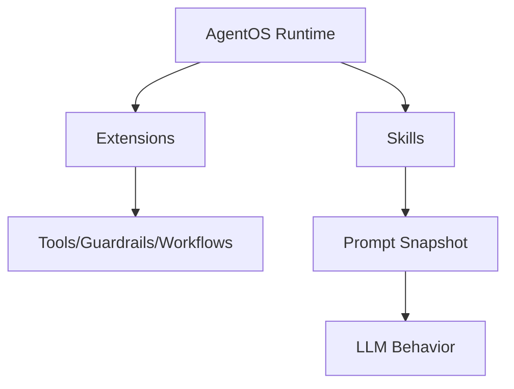
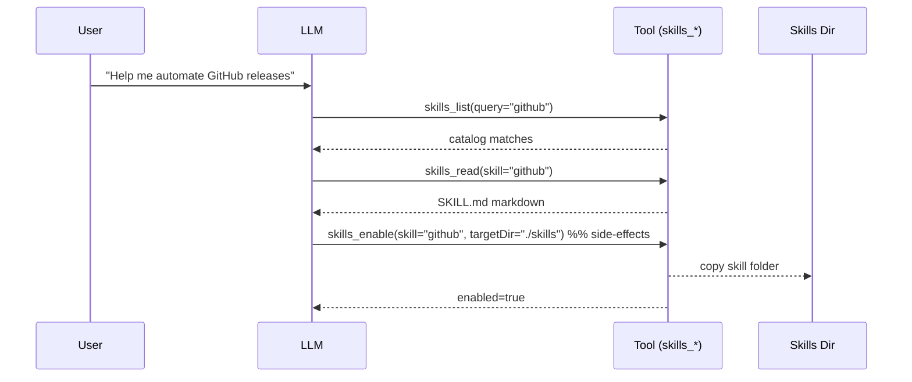

# Skills (SKILL.md)

Skills are **modular prompt modules** that extend what an AgentOS-based agent can do. Each skill lives in a folder containing a `SKILL.md` file:

- YAML frontmatter: metadata, requirements, install specs, invocation policy
- Markdown body: instructions injected into an agent’s system prompt (or fetched on-demand)

## Skill Docs

- Skill format: [`SKILL.md`](./skill-format)
- Curated skills registry: [`@framers/agentos-skills-registry`](./agentos-skills-registry) (data + typed SDK + factories)

## Skills vs Extensions

Skills and extensions solve different problems:

- **Extensions**: runtime code (tools, guardrails, workflows) loaded into AgentOS via the extensions system.
- **Skills**: prompt-level “how to” modules that teach an agent _when_ and _how_ to use tools and workflows.



## Loading Skills With [`SkillRegistry`](https://github.com/framerslab/agentos/blob/master/src/cognition/skills/SkillRegistry.ts)

Use [`SkillRegistry`](https://github.com/framerslab/agentos/blob/master/src/cognition/skills/SkillRegistry.ts) to load skills from one or more directories and compile them into a single prompt snapshot:

```ts
import { SkillRegistry } from '@framers/agentos/skills';

const registry = new SkillRegistry();
await registry.loadFromDirs(['./skills']);

const snapshot = registry.buildSnapshot({ platform: process.platform, strict: true });
console.log(snapshot.prompt);
```

## Curated Skills Packages

The curated skills ecosystem ships as two packages:

- `@framers/agentos-skills`: Content (88 SKILL.md files + registry.json)
- `@framers/agentos-skills-registry`: Catalog SDK (SKILLS_CATALOG, query helpers, snapshot factories)

It supports a lightweight import path:

```ts
import { searchSkills, getSkillsByCategory } from '@framers/agentos-skills-registry/catalog';
```

…and a factory path that lazy-loads `@framers/agentos` only when you call it:

```ts
import { createCuratedSkillSnapshot } from '@framers/agentos-skills-registry';

const snapshot = await createCuratedSkillSnapshot({ skills: ['github', 'weather'] });
```

## On-Demand Skill Discovery (Lazy)

If you don’t want to inject all skill prompt content up front, use the **skills tools** from the engine:

- `@framers/agentos/skills` (via [`SkillRegistry`](https://github.com/framerslab/agentos/blob/master/src/cognition/skills/SkillRegistry.ts)): exposes `skills_list`, `skills_read`, `skills_status`, `skills_enable`, `skills_install`
- Skill content (the actual SKILL.md files) ships in `@framers/agentos-skills`

This enables a “lazy” flow where the model can:

1. List/search skills (`skills_list`)
2. Fetch a specific `SKILL.md` only when needed (`skills_read`)
3. Enable a skill into a local skills directory (HITL-gated) (`skills_enable`)



## Capability Discovery Integration

Beyond lazy loading, skills are fully indexed by the **Capability Discovery Engine** (`@framers/agentos/discovery`). This provides semantic search across all capabilities -- tools, skills, extensions, and channels -- using embedding similarity and graph re-ranking.

Skills become [`CapabilityDescriptor`](https://github.com/framerslab/agentos/blob/master/src/cognition/discovery/types.ts) entries with `kind: 'skill'` and are indexed alongside tools. The discovery engine’s graph tracks relationships between skills and their required tools (e.g., `skill:web-search` -> `DEPENDS_ON` -> `tool:web_search`), so searching for either surfaces both.

**Skills vs extensions in discovery**: Skills are prompt-level modules (`SKILL.md`) that teach _when_ and _how_ to use tools. Extensions are runtime code (tools, guardrails, workflows) that provide callable actions. Both feed into the same discovery index, but you don’t need a skill for every tool -- many tools work fine with just their schema. Skills add value when a tool needs behavioral guidelines beyond its name and parameters.

For Wunderland agents, `WunderlandDiscoveryManager` handles indexing automatically. For standalone AgentOS usage:

```ts
import { CapabilityDiscoveryEngine } from '@framers/agentos/discovery';

const engine = new CapabilityDiscoveryEngine(config);
await engine.initialize({
  tools: toolMap,
  skills: skillEntries,
});

const result = await engine.discover('search the web');
// result.tier0: category summaries (~150 tokens)
// result.tier1: top-5 semantic matches with summaries (~200 tokens)
// result.tier2: full schemas for top matches (~1,500 tokens)
```

## Full Usage Examples

### AgentOS: Load skills + extensions together

```ts
import type { ITool } from '@framers/agentos';
import { CapabilityDiscoveryEngine } from '@framers/agentos/discovery';
import { createCuratedManifest } from '@framers/agentos-extensions-registry';

// 1. Load skills from curated registry
const { createCuratedSkillSnapshot } = await import('@framers/agentos-skills-registry');
const skillSnapshot = await createCuratedSkillSnapshot({
  skills: ['github', 'web-search', 'coding-agent'],
});

// 2. Load extensions (tools + voice)
const manifest = await createCuratedManifest({
  tools: ['web-search', 'web-browser', 'giphy'],
  voice: ['speech-runtime'],
});

// 3. Collect ITool instances from resolved extension packs
const tools = new Map<string, ITool>();
for (const packEntry of manifest.packs) {
  if (!('factory' in packEntry) || typeof packEntry.factory !== 'function') continue;
  const extensionPack = await packEntry.factory();
  for (const descriptor of extensionPack.descriptors) {
    if (descriptor.kind === 'tool') {
      tools.set(descriptor.payload.name, descriptor.payload as ITool);
    }
  }
}

// 4. Initialize discovery (indexes tools + skills for semantic search)
const discovery = new CapabilityDiscoveryEngine();
await discovery.initialize({ tools, skills: skillSnapshot.resolvedSkills });

// 5. Inject skill prompt into system prompt
const systemPrompt = `You are an AI assistant.\n\n${skillSnapshot.prompt}`;
```

### AgentOS: Load ALL curated skills

```ts
import { searchSkills } from '@framers/agentos-skills-registry/catalog';
import { createCuratedSkillSnapshot } from '@framers/agentos-skills-registry';

const allSkills = searchSkills(''); // empty query returns all
const snapshot = await createCuratedSkillSnapshot({
  skills: allSkills.map((skill) => skill.name),
});
console.log(`Loaded ${snapshot.skills.length} skills`);
```

### AgentOS: Load skills from local directories

```ts
import { SkillRegistry } from '@framers/agentos/skills';

const registry = new SkillRegistry();
await registry.loadFromDirs(['./skills', './vendor-skills']);

const snapshot = registry.buildSnapshot({ platform: process.platform, strict: true });
console.log(`Loaded ${registry.count()} skills from disk`);
console.log(snapshot.prompt); // inject into system prompt
```

### Wunderland: One-line setup with everything

With the Wunderland library API, skills, extensions, and discovery are configured in a single call:

```ts
import { createWunderland } from 'wunderland';

// Load specific skills + extensions
const app = await createWunderland({
  llm: { providerId: 'openai' },
  tools: 'curated',
  skills: ['github', 'web-search', 'coding-agent'],
  extensions: {
    tools: ['web-search', 'web-browser', 'giphy'],
    voice: ['speech-runtime'],
  },
});

// Or load everything at once
const fullApp = await createWunderland({
  llm: { providerId: 'openai' },
  tools: 'curated',
  skills: 'all', // all curated skills for the current platform
  extensions: {
    tools: ['web-search', 'web-browser', 'news-search', 'image-search', 'giphy', 'cli-executor'],
    voice: ['speech-runtime'],
  },
});

// Or use a preset (auto-configures skills + extensions)
const presetApp = await createWunderland({
  llm: { providerId: 'openai' },
  preset: 'research-assistant',
});
```

### Check what’s loaded

```ts
const diag = app.diagnostics();
console.log('Tools:', diag.tools.names); // ['web_search', 'giphy_search', ...]
console.log('Skills:', diag.skills.names); // ['github', 'web-search', ...]
console.log('Discovery:', diag.discovery); // { initialized: true, capabilityCount: 25, ... }
```
